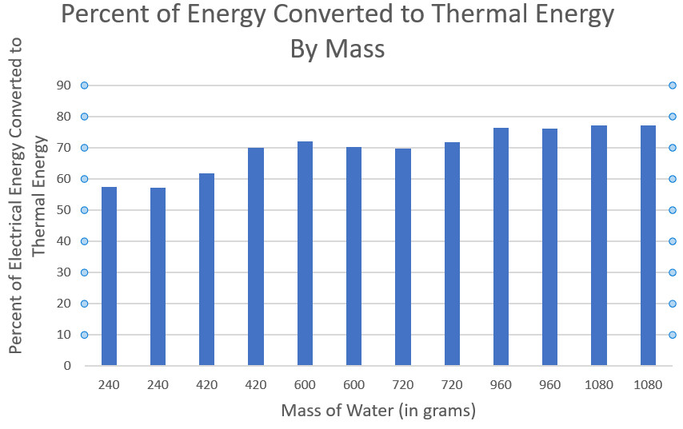

#### Research Question

What percentage of energy consumed by my home electric kettle is directly converted to thermal energy in the water? Does this change as the mass of water used increases?

#### Data

This table shows the raw measurements taken during the tests. Temperature was taken with a Farenheit thermometer and converted to Celsius. Initial temperature was taken right before heating, with the water in the kettle, and final temperature was taken right after heating. The time was calculated from the heating process being started until the kettle clicked off.

| Test | Water Mass | Initial Temperature | Final Temperature | Increase in Temperature | Heating Time |
|------|------------|---------------------|-------------------|-------------------------|--------------|
| 1    | 240 g      | 25.6 Celsius        | 93.9 Celsius      | 68.3 Celsius            | 79 Seconds   |
| 2    | 240 g      | 28.9 Celsius        | 91.1 Celsius      | 82.2 Celsius            | 75 Seconds   |
| 3    | 420 g      | 15.6 Celsius        | 95.6 Celsius      | 80.0 Celsius            | 138 Seconds  |
| 4    | 420 g      | 20.0 Celsius        | 93.9 Celsius      | 73.9 Celsius            | 130 Seconds  |
| 5    | 600 g      | 21.7 Celsius        | 94.4 Celsius      | 72.7 Celsius            | 168 Seconds  |
| 6    | 600 g      | 17.8 Celsius        | 93.3 Celsius      | 75.5 Celsius            | 180 Seconds  |                 
| 7    | 720 g      | 16.7 Celsius        | 93.3 Celsius      | 76.6 Celsius            | 218 Seconds  |
| 8    | 720 g      | 15.6 Celsius        | 93.3 Celsius      | 77.7 Celsius            | 213 Seconds  |
| 9    | 960 g      | 28.9 Celsius        | 94.4 Celsius      | 65.5 Celsius            | 226 Seconds  |
| 10   | 960 g      | 15.6 Celsius        | 93.9 Celsius      | 78.3 Celsius            | 280 Seconds  |
| 11   | 1080 g     | 14.4 Celsius        | 95.6 Celsius      | 81.2 Celsius            | 318 Seconds  |
| 12   | 1080 g     | 21.1 Celsius        | 95.0 Celsius      | 73.9 Celsius            | 296 Seconds  |

### Equations

There are two main equations used for this experiment:

Equation 1: change in thermal energy = mass × specific heat capacity × change in temperature [1]

Equation 2: energy = power * time [2]

The specific heat capacity of water is 4.2 J/kg°C [1]. The change of thermal energy in the water can be found by using Equation 1 with this constant. The kettle consumes 1500 watts of power. Using that in Equation 2 with with the heating time can be used to determine the total energy consumed by the kettle.

### Results

This table shows the change in thermal energy, energy consumption, and percent of energy consumed that is converted to thermal energy in the water.

| Test | Increase in Thermal Energy | Energy Consumed | Percent of Energy Converted |
|------|----------------------------|-----------------|-----------------------------|
| 1    | 6.9 * 10^5 J               | 1.2 * 10^6 J    | 57.5 %                      |
| 2    | 6.3 * 10^5 J               | 1.1 * 10^6 J    | 57.3 %                      |
| 3    | 1.4 * 10^6 J               | 2.1 * 10^6 J    | 67.0 %                      |
| 4    | 1.3 * 10^6 J               | 2.0 * 10^6 J    | 65.0 %                      |
| 5    | 1.8 * 10^6 J               | 2.5 * 10^6 J    | 72.0 %                      |
| 6    | 1.9 * 10^6 J               | 2.7 * 10^6 J    | 70.4 %                      |                
| 7    | 2.3 * 10^6 J               | 3.3 * 10^6 J    | 69.7 %                      |
| 8    | 2.3 * 10^6 J               | 3.2 * 10^6 J    | 71.9 %                      |
| 9    | 2.6 * 10^6 J               | 3.4 * 10^6 J    | 76.5 %                      |
| 10   | 3.2 * 10^6 J               | 4.2 * 10^6 J    | 76.2 %                      |
| 11   | 3.7 * 10^6 J               | 4.8 * 10^6 J    | 77.1 %                      |
| 12   | 3.4 * 10^6 J               | 4.4 * 10^6 J    | 77.3 %                      |

This graph shows what percentage of the electrical energy that was consumed by the kettle, organized by mass of the water:

### Conclusion

Based on the graph, it appears that energy efficiency increases as the mass of the water being heated increases. The suggested water quantity for the kettle is 0.5 to 1 liter; tests 1 through 4 are below that level, and there seems to be a noticeable increase in efficiency when the water mass crosses that threshold. In general, outside of the tests below the minimum water level, the kettle appears to convert between 70 and 80 percent of energy used into thermal energy in the water, increasing as the water mass increases.

### Citation

[1] "Energy, temperature and change of state". Bitesize, BBC, 2020. https://www.bbc.co.uk/bitesize/guides/zg6bdxs/revision/3

[2] Knight, Randall D. "Physics for Scientists and Engineers: a strategic approach with modern physics". Fourth Edition. Boston: Pearson Education, Inc, 2015-2017.
